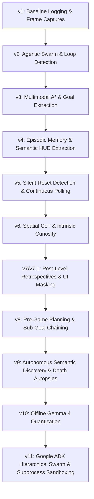

# Chronos Solver: Architectural Evolution and Multi-Agent Design

The **Chronos Solver** is a state-of-the-art autonomous agent framework built to tackle the Abstraction and Reasoning Corpus (ARC-AGI) environment. By combining symbolic search algorithms, neural network fallbacks, and hierarchical multi-agent teams powered by local multimodal LLMs (Gemma 4), it achieves human-level reasoning capabilities in interactive 2D grid environments.

---

## 1. Project Overview (High-Level Summary)

At a high level, the Chronos Solver is designed to solve complex grid puzzles that require abstract reasoning, spatial awareness, and dynamic interaction. Traditional LLMs fail at ARC-AGI due to a lack of visual-spatial grounding and poor sequence planning. Chronos Solver bridges this gap by marrying **symbolic computer science** (A* pathfinding, BFS, action compression, coordinate overlays) with **agentic LLM orchestration** (hierarchical planning, memory buffers, autonomous semantic discovery, and subprocess sandboxing).

The project is structured around an evolutionary mindset. The codebase has progressed through 11 major versions, transitioning from a simple baseline search agent into a highly sophisticated, offline-compatible multi-agent swarm running on local hardware (macOS Metal / Kaggle GPUs).

---

## 2. Architectural Evolution (v1 to v11)

The development of the Chronos Solver is a study in iterative agent design, resolving specific cognitive bottleneck failures in each generation.



### v1: Baseline Logging & Visualization
*   **Concept:** Established the foundational run-harness.
*   **Mechanics:** Simple logging to `v1_run.log` and step-by-step matplotlib frame captures to `images/`.
*   **Failures:** Timed out on deep mazes due to BFS complexity; fallback CNN models suffered from infinite oscillation loops (UP/DOWN/LEFT/RIGHT).

### v2: Agentic Swarm & Delegation
*   **Concept:** Decomposed monolithic planning into specialized roles.
*   **Mechanics:** Introduced `VisionScout` (coordinates extraction), `Planner` (splits deep search into intermediate waypoints using short-range BFS), and `Critic` (anti-oscillation watchdog that vetos cyclic states and forces random exploration).
*   **Failures:** Blind random exploration moves frequently collided with walls, and the agent lacked spatial understanding of the overall maze.

### v3: Multimodal A* Swarm
*   **Concept:** Upgraded swarm from "uninformed" to "informed" search.
*   **Mechanics:** Integrated Gemini Vision to extract `(x, y)` coordinate goals. Replaced BFS with **A* Search** (Manhattan distance heuristic). Implemented wall-aware action masking to prevent the Critic from picking collision moves.
*   **Failures:** Had "amnesia" across level resets; repeated identical fatal mistakes upon respawning.

### v4: Episodic Memory & HUD Semantics
*   **Concept:** Cross-episode persistence.
*   **Mechanics:** Introduced the **Episodic Memory Buffer (EMB)** to record fatal state hashes on `GAME_OVER` and mask them in future pathfinding. Upgraded prompts to extract HUD details (lives, fuel). Added a global semantic cache for cross-level concept transfer.
*   **Failures:** Environment handled deaths with "silent resets" (teleporting to spawn without triggering a formal API `GAME_OVER`), leaving the agent oblivious to its own death.

### v5: Silent Reset Detection & Coaching
*   **Concept:** Synchronization of cognitive and environment state.
*   **Mechanics:** Created a distance-based **Silent Reset Detector** (instantly flags a death if coordinates teleport). Implemented continuous vision polling (Gemini acts as a real-time coach every 5-10 steps) and an active puzzle memory monologue.
*   **Failures:** Vision output suffered from stale/static loops, and the agent lacked curiosity to explore new objects.

### v6: Spatial Chain-of-Thought (CoT) & Curiosity
*   **Concept:** Intrinsic motivation and spatial reasoning.
*   **Mechanics:** Forced Gemini to output a `"spatial_analysis"` thinking block before coordinates. Added `"unknown_objects"` identification with A* curiosity bonuses. Created a persistent **Action-Effect Rulebook** (e.g., *green cross = +25 fuel*). Passed 5-frame histories for temporal awareness.
*   **Failures:** BFS/A* coordinate tracking was dragged down by the blinking UI timer bar at the bottom of the screen; the agent was overly curious about deadly hazards.

### v7 & v7.1: Retrospectives, Calibration & UI Masking
*   **Concept:** Precise spatial mapping and hazard avoidance.
*   **Mechanics:** 
    *   **Post-Level Retrospectives:** Visual recap after programmatic victories to extract rules for the global Wiki.
    *   **Grid Overlay:** Calibrated LLM outputs to strict 0-63 indices instead of raw pixels.
    *   **v7.1 Upgrades:** Masked out bottom UI regions from tracking, separated `interactive_objects` from `hazards` (penalizing hazard proximity by -500 in A*), and cropped images for robust local-hash reset detection.

### v8: Pre-Game Planning & Sub-Goal Chaining
*   **Concept:** Proactive hypothesis-driven play.
*   **Mechanics:** Pause at start of level to formulate a plan using Gemini's high-reasoning **Deep Think** config (`ThinkingConfig` with `thinking_level="HIGH"`). Platted a chained graph of sub-goals. Introduced **Session Memory** (persisting attempts and active hypotheses for the current level across deaths).

### v9: Autonomous Semantic Discovery & Death Autopsies
*   **Concept:** Game-agnostic adaptability and forensic analysis.
*   **Mechanics:** 
    *   **Autonomous Semantic Discovery:** Discovers the player, gauges, and reset criteria from scratch using contrastive frame analysis (removing hardcoded assumptions).
    *   **Death Autopsies:** Pauses on death to run Gemini on frames right before/after to document the failure reason, passing this autopsy directly into the next iteration to adjust the gameplay path.

### v10: Local & Offline Migration
*   **Concept:** Zero-dependency, offline execution.
*   **Mechanics:** Replaced the cloud Gemini API with **Gemma 4 (31B)**. Implemented 4-bit (NF4) quantization to fit the model within 20GB VRAM. Added support for splitting inference across Kaggle's dual T4 GPUs (`device_map="auto"`) and running local servers (vLLM, llama.cpp, Ollama).

---

## 3. Deep Dive: Chronos Solver v11

Chronos Solver v11 represents the production-ready pinnacle of the framework, completely integrating with the **Google ADK (Agent Development Kit) Framework** and local **multimodal Gemma 4 (12B/31B)** models to run 100% offline.

```
                  ┌──────────────────────────────────────────┐
                  │          ManagerAgent (Tier 1)           │
                  │        (Root Orchestrator/State)         │
                  └────────────────────┬─────────────────────┘
                                       │
                ┌──────────────────────┴──────────────────────┐
                ▼                                             ▼
     ExplorationLead (Tier 2)                      ModelingLead (Tier 2)
  ┌─────────────────────────────┐               ┌─────────────────────────────┐
  │  - SymmetryCheckerAgent     │               │  - PatternMatcherAgent      │
  │  - GravityPhysicsAgent      │               │  - ObjectExtractorAgent     │
  │  - ColorPaletteAgent        │               │  - ScaleFactorAgent         │
  │  - PixelCountAgent          │               │  - TranslationAgent         │
  │  - BackgroundDetectorAgent  │               │  - RotationAgent            │
  └─────────────────────────────┘               │  - ReflectionAgent          │
                                                └──────────────┬──────────────┘
                                                               │
                                                               ▼
                                                    GoalSettingLead (Tier 2)
                                                ┌─────────────────────────────┐
                                                │ (Identifies intermediate)   │
                                                │ (   sub-goal target grids   )│
                                                └──────────────┬──────────────┘
                                                               │
                                                               ▼
                                                     PlanningLoop (Tier 2)
                                                ┌─────────────────────────────┐
                                                │ PlanningLead                │
                                                │     └► Action Compression   │
                                                │ CodeCreatorAgent (Tier 3)   │
                                                │     └► Subprocess Sandbox   │
                                                └─────────────────────────────┘
```

### Three-Tier Agent Hierarchy
1.  **Tier 1: Root Orchestrator (`ManagerAgent`)**
    Manages the high-level cognitive state, ingests history, logs run timelines, and delegates analytical goals.
2.  **Tier 2: Pillar Leads**
    *   `ExplorationLead`: Manages a parallel cluster of check agents analyzing physical/structural symmetries, gravity, and colors.
    *   `ModelingLead`: Coordinates structural matcher agents tracking objects, scales, rotations, and spatial translations.
    *   `GoalSettingLead`: Translates insights from the Modeling and Exploration leads into concrete sub-goal target grids.
    *   `PlanningLead`: Converts target grids into coordinate paths and directional keys, executing a callback to perform **action compression** (merging redundant clicks and optimizing movements).
3.  **Tier 3: Specialized Sub-Agents**
    18 narrowly-scoped functional experts (e.g. `CornerFinderAgent`, `LineDrawerAgent`). Most notably, the `CodeCreatorAgent` translates proposed actions into python mathematical scripts.

### The Subprocess Sandbox Validator
A core innovation of v11 is the elimination of action path hallucinations. When the `PlanningLead` proposes a trajectory, the `CodeCreatorAgent` writes a python script to simulate that trajectory. 
*   This script is executed in an isolated subprocess sandbox using `subprocess.run` with a strict 5-second timeout.
*   If the script runs successfully and matches the target sub-goal, the state flag `simulation_passed` is set to `True`, triggering an ADK LoopAgent escalation to bypass further planning iterations and execute.

---

## 4. Key Benefits of the Architecture

By moving from a monolithic, API-reliant agent to the local multi-agent system of v11, Chronos Solver achieves massive advantages:

### 1. Zero Token Costs (Financial and Scaling Viability)
*   **The Cost Trap:** In a complex ARC level, querying a model for continuous vision, sub-agent analyses, retrospectives, and autopsies can consume **1 million+ tokens per game**. Over hundreds of games, cloud API bills explode.
*   **The Solution:** Running Gemma 4 locally via Ollama or Hugging Face costs **$0.00** in token fees. The only resource is local electricity, making hyper-iterative research financially viable.

### 2. Strict Offline Compliance (Kaggle Rules)
*   ARC-AGI competition servers strictly forbid internet access during scoring to prevent data leakage. 
*   Chronos Solver v11 fits model weights, pre-trained CNN fallbacks (`ForgeNet`), dependencies, and execution runtimes entirely inside Kaggle datasets, running offline with dual-GPU tensor splitting.

### 3. Safety and Reliability via Symbolic Sandboxing
*   Purely LLM-based solvers suffer from hallucinations—they write commands that jump walls or click out of bounds.
*   By executing proposed plans through a **python sandbox validator** and backing it up with programmatic **A* pathfinding** and collision masks, Chronos Solver guarantees that every executed action is physically valid in the game engine.

### 4. Continuous Learning (Episodic and Session Memory)
*   Most agents suffer from "amnesia"—once reset, they repeat their mistakes.
*   Chronos Solver's combination of **Episodic Memory** (fatal hash masking), **Session Memory** (level attempt logs), and **Action-Effect Rulebooks** (long-term mechanics Wiki) mimics human play, ensuring the agent becomes smarter with every level completion and death.

### 5. Hyper-Targeted Competence (Decomposed Cognitive Load)
*   A single LLM prompt trying to count pixels, check symmetry, plan path coordinates, and detect gravity will experience cognitive overload.
*   Decomposing these tasks into 18 specialized sub-agents ensures that each LLM invocation is highly focused, achieving near-perfect accuracy on simple, narrow queries.
