# Chronos Solver: Architectural Evolution and Multi-Agent Design (v1 → v19)

**GitHub:** https://github.com/shreyasmahimkar/arc-agi-3

The **Chronos Solver** is an autonomous agent framework for **ARC-AGI-3** — an
interactive 2D-grid reasoning benchmark where an agent must learn a *novel* game's
rules from pixels, with no instructions and a sparse reward. Across 19 major
versions it evolved through three distinct eras: **(I) multi-agent LLM
orchestration** (v1–v11), **(II) pure symbolic search** (v12–v13), and **(III)
model-based RL + honest generalisation science** (v14–v19).

This document preserves the original v1–v15 history and **appends v16–v19**, with a
**reality-check** on v19 (the earlier summary over-stated it as a finished LLM
swarm / world model — the truth is more nuanced and more interesting).

---

## 1. Project Overview

Traditional LLMs fail at ARC-AGI (frontier models score **< 1%**, humans 100%) due
to weak visual-spatial grounding and poor long-horizon planning. Chronos bridges
this by marrying **symbolic CS** (BFS/A*/Iterated-Width search, action compression,
coordinate overlays) with, depending on the era, **agentic LLM orchestration**,
**parallel symbolic solvers**, or **learned world models**. The codebase is an
evolutionary study: each generation diagnoses and resolves a specific cognitive
bottleneck of the last.

A crucial, hard-won scoring fact frames the later eras: on the actual ARC-AGI-3
competition, **live white-box BFS (v12) scored 0.22**, while a purely black-box
neural agent (v18/v19 ablation) scored **~0.01**. The competition *ships the game
sources* in `environment_files/`, so genuine BFS reaches them and **generalises to
the scored set** — which is why every late version keeps **BFS-first**.

---

## 2. Architectural Evolution (v1 → v19)

```mermaid
graph TD
   v1["v1: Baseline Logging & Frame Captures"] --> v2["v2: Agentic Swarm & Loop Detection"]
   v2 --> v3["v3: Multimodal A* & Goal Extraction"]
   v3 --> v4["v4: Episodic Memory & Semantic HUD"]
   v4 --> v5["v5: Silent Reset Detection & Polling"]
   v5 --> v6["v6: Spatial CoT & Intrinsic Curiosity"]
   v6 --> v7["v7/7.1: Retrospectives & UI Masking"]
   v7 --> v8["v8: Pre-Game Planning & Sub-Goal Chaining"]
   v8 --> v9["v9: Autonomous Discovery & Death Autopsies"]
   v9 --> v10["v10: Offline Gemma Quantization"]
   v10 --> v11["v11: Google ADK Hierarchical Swarm"]
   v11 --> v12["v12: Pure Symbolic & Parallel BFS (0.22)"]
   v12 --> v13["v13: Multi-Game Sweep + IW/EHC Ladder + CNN fallback"]
   v13 --> v14["v14: Causal PLM World Model & VQ Tokenizer"]
   v14 --> v15["v15: Token-Conditioned Dynamics & Memorization Fix"]
   v15 --> v16["v16: Generalisation Curriculum (PLAN, gated)"]
   v16 --> v17["v17: Informed Search — ForgeNet heuristic + TRM + MCTS"]
   v17 --> v18["v18: Black-box Pivot — ChangeNet + Exploration Graph"]
   v18 --> v19["v19: SYNTHESIS — BFS-first + black-box fallback + ExIt world-model flywheel"]
```

---

## 3. Era I — Multi-Agent LLM Orchestration (v1 → v11)

*(Preserved from the original writeup; condensed.)*

- **v1 — Baseline.** Run-harness, logging, `matplotlib` frame captures. *Failed:* BFS
  timed out on deep mazes; CNN fallback oscillated infinitely.
- **v2 — Agentic Swarm.** Decomposed planning into `VisionScout`, `Planner`, `Critic`
  (anti-oscillation watchdog). *Failed:* blind exploration hit walls.
- **v3 — Multimodal A\*.** Gemini-Vision coordinate extraction; A* replaces BFS.
  *Failed:* level-reset amnesia → repeated fatal mistakes.
- **v4 — Episodic Memory.** Episodic Memory Buffer records fatal state hashes on
  `GAME_OVER` and masks them; HUD semantics (lives/fuel); cross-level concept cache.
  *Failed:* "silent resets" (teleport to spawn, no API `GAME_OVER`).
- **v5 — Silent-Reset Detection.** Distance-based death detector; continuous vision
  polling (Gemini as a real-time coach). *Failed:* stale vision loops; low curiosity.
- **v6 — Spatial CoT + Curiosity.** Forced `spatial_analysis` block; `unknown_objects`
  + A* curiosity bonus; Action-Effect Rulebook; 5-frame histories. *Failed:* blinking
  UI timer-bar polluted coordinate tracking; over-curious about hazards.
- **v7 / v7.1 — Retrospectives & UI Masking.** Post-level visual recaps → rule Wiki;
  0–63 grid-overlay calibration; masked UI rows; separated `hazards` from
  `interactive_objects` (A* −500 hazard penalty); cropped-hash reset detection.
- **v8 — Pre-Game Planning.** Pause-and-plan with Gemini "Deep Think"; chained
  sub-goal graph; per-level Session Memory across deaths.
- **v9 — Autonomous Discovery + Death Autopsies.** Discovers player/gauges/reset
  criteria via contrastive frame analysis (no hardcoding); forensic death analysis
  fed into the next iteration.
- **v10 — Offline Migration.** Swapped cloud Gemini → **Gemma (4-bit NF4)**, dual-T4
  `device_map="auto"`, local servers (vLLM/llama.cpp/Ollama).
- **v11 — Google ADK Hierarchical Swarm.** 3-tier hierarchy (Manager → Leads → 18
  sub-agents). `CodeCreatorAgent` compiles a proposed plan into Python and runs it
  in a **5 s subprocess sandbox** to validate path physics → eliminates
  hallucinated trajectories before execution.

**Lesson that ended Era I:** LLM orchestration is expensive, slow, and unreliable
for *precise long-horizon action sequencing*. The benchmark is a search problem.

---

## 4. Era II — Pure Symbolic Search (v12 → v13)

- **v12 — Parallel BFS.** Deprecated ADK/Ollama/vision. A C-optimised parallel
  `BFSSolver`: `zlib`-pickle state snapshots (O(1) restore), **transient-pixel
  masking** (timer-bar filter), and **chained level baselines** (replay L0..Lₙ₋₁ to
  build level N's true start). **This is the version that scored 0.22** on the real
  competition. *Failed:* warmup-prefix desyncs; 500k-state caps on deep levels.
- **v13 — Multi-Game Sweep + Search Ladder.** `solve_all.py`/`verify_all.py` run
  manager; **GPU OOM backoff**; dynamic click-target tracking (object centroids).
  v13's lineage builds the full **search ladder** — `bfs → sense → IW1/IW2 → EHC →
  waypoint → A* → greedy → rescues` (Iterated Width = novelty-pruned BFS; waypoint =
  sub-goal decomposition; greedy = progress shaping) — plus a CNN (ForgeNet/AEM)
  policy fallback. *Failed:* the CNN fallback had weak zero-shot generalisation.

---

## 5. Era III — Model-Based RL & Generalisation Science (v14 → v19)

### v14 — Causal PLM World Model & VQ Tokenizer
Replaced the CNN policy with a **Predictive Language Model**: a VQ-VAE `Tokenizer`
(K=1024 codebook) compresses each (C,64,64) frame to discrete `(D,8,8)` tokens; a
transformer `BeliefCore` + `BlockCausalSimulator` predict next-frame tokens.
*Failed (instructively):* the simulator predicted 64 tokens from a pooled belief
bottleneck using static queries → it **memorised training trajectories** (99.7%
train / **36.6% fresh-episode** accuracy).

### v15 — Token-Conditioned Dynamics (the "memorisation fix")
Redesigned the simulator to **cross-attend over the current frame's 64 token
embeddings**, so identity-copy is the default residual and the model only learns
**deltas** (dynamics). Fresh-episode accuracy **36.6% → >90%**. Added a curiosity
`Goose` agent and Test-Time-Training hooks. *This is a textbook residual-modelling
fix — making "copy" easy so capacity goes to dynamics.*

### v16 — Generalisation Curriculum (PLAN-only, gated)
A **planning document**, deliberately not built until v15's Mac gate passed
(fresh-episode acc ≥ 0.90, above a copy baseline). It specifies the curriculum:
master ONE game end-to-end (ar25→ar25), then scale to multi-game transfer via the
**arc-interactive community games** (the 200+ game testbed). v16 is the project's
discipline made explicit: *don't scale generalisation work until single-game
modelling is proven.*

### v17 — Informed Search (ForgeNet heuristic + TRM + MCTS imagination)
Thesis: hard levels (e.g. `ls20` L5, a dual-key puzzle) die of **breadth**, not
walls. v17 turns BFS into a *depth-first dive* with a **learned cost-to-go
heuristic (CNN ForgeNet)** and a **Tiny Recursive Model (TRM)** policy/value (an
ExIt apprentice), then adds **macro-actions**, **progress shaping**, **sub-goal
re-rooting**, **BFWS novelty**, multiprocess expansion, and **forward-rollout MCTS**
("imagination search" — restore once, roll forward in the real model). It moved the
`ls20` L5 wall from depth 8 → progress 3, but never fully solved it — diagnosing the
remaining gap as compute + a *learned* prior, which motivates v18/v19.

### v18 — The Black-Box Pivot (ChangeNet + Exploration Graph)
A clean-room reframing around the actual *scored* interface (frame-only, one action
at a time). Fuses the two ARC-AGI-3 **preview winners**: **ChangeNet** (a CNN
predicting which action changes the frame — *StochasticGoose*, 1st, 12.6%) and a
**frame transition graph with frontier exploration** (*Blind Squirrel*, 2nd, 6.7%),
plus **Go-Explore** directed exploration and macro-actions. Crucially it introduced
a **frozen held-out split of games** and honest transfer evaluation — and **genuinely
generalised**, solving **3/5 held-out games it had never seen** (cn04, sk48, tu93),
no stored answers. **But:** as a *standalone* black-box agent it scored only ~0.01 on
the real competition — proving black-box exploration alone is too weak, and that the
white-box BFS must stay in front.

### v19 — The Synthesis (BFS-first + black-box fallback + ExIt flywheel)
v19 **combines the lineage**: the v13_3 BFS ladder (the 0.22 engine) as the primary
solver, the v18 black-box ChangeNet agent as the **fallback for hidden / source-
unreachable games**, and a **model-based ExIt flywheel** as the research engine to
lift generalisation. See §6.

---

## 6. Deep Dive: v19 — what it actually is (reality check)

The earlier summary implied v19 was a finished multi-agent LLM swarm / world model.
**It is not.** v19 is a **hybrid, BFS-first, model-in-the-loop system** with an
honest, still-open research question. Here is the truth:

### 6.1 Routing — BFS-first, learned fallback
`combined_agent.py` routes per game:
- **White-box source reachable** → the **BFS search ladder** solves live (near-
  optimal; this is what scores 0.22). Genuine search, not recall.
- **No source (hidden game) / BFS times out** → the **pretrained black-box
  ChangeNet + exploration-graph** agent takes over (frame-only, generalises by
  construction).
- **Solution cache = a TIMEOUT BACKSTOP only** (`V19_CACHE_FALLBACK`), loaded
  *lazily* and never as the first move — genuine solving always goes first. (Policy
  refined after the human-baseline analogy: it's fine to fall back on a remembered
  solution *after* a fair live attempt.)

### 6.2 The ExIt flywheel (the model-based engine)
`solve → harvest → train world model → repeat`:
- **Solver** generates expert `(state→action)` demonstrations (a "label factory").
- **`harvest_wm.py`** replays them through the real engine → `(frame, action,
  next_frame, reward)` transitions.
- **`train_wm_v19.py`** trains a convolutional **forward dynamics model**
  (next-frame = 16-way per-pixel classification; reward = binary head with
  **optimistic ×20 up-weighting** of the sparse "level-complete" signal).
- **`wm_planner.py`** does **MPC in imagination** — beam-search action sequences
  *inside the model* (free), then verify the chosen action on the real engine.
This is AlphaZero-style Expert Iteration: bootstrap a generalising learner from a
search oracle, with the eventual goal of the learner guiding the search.

### 6.3 Honest generalisation science (the part that matters)
- **Held-out split by *game*** (not by frame) + a stable hash-bucket so it scales to
  274 games. Metric = **changed-pixel accuracy** (overall pixel accuracy is a vanity
  metric — most pixels are background).
- **Save-gate on transfer:** warm-start from the previous weights, **keep only if
  held-out improves**, early-stop on plateau → the shipped model improves
  *monotonically*, and a plateau is an explicit "more compute won't help" signal.
- **Controlled ablations, including failures:** the WM's transfer **plateaued at
  ~0.17 and over-fit**. Hypothesis: colour-overfitting. Test: a clean A/B of
  colour-permutation (+D4) augmentation. Result, logged honestly **twice**:
  `lift = −0.02` (Mac) and `lift = −0.061` (RTX, +D4). **A disproved hypothesis,
  reported as one** — colour aug was killed, not tuned.
- **The decision tree (before spending GPU):** chg-acc climbs with corpus →
  data-limited; climbs with capacity (`net_mult 4`) → capacity-limited; only
  object/relational features move it → representation-limited; nothing moves it →
  architecture-bound. The RTX run's negative result points at **representation/
  architecture-bound** — so the next lever is object-centric features, *not* a
  bigger GPU.

### 6.4 The black-box agent internals (v18 → v19, hardened)
ChangeNet (now **width-scalable** via `net_mult`, with `from_state_dict` inferring
width) ranks untried actions; the transition graph + frontier planner navigate to
the nearest unexplored state ("never knowingly repeat a transition" — RHAE-aware);
**pixel-level transient masking** kills timer/counter noise; **macro-actions**
collapse corridors; **GAME_OVER** triggers reset-and-continue; **component +
grid click targets** handle click-puzzles.

---

## 7. Latest Improvements (v19, this iteration)

| improvement | what / why |
|---|---|
| **274-game corpus** | brought in the 200+ **arc-interactive** community games → far more diverse training data for transfer (the data lever) |
| **ExIt flywheel + auto-commit** | `exit_cycle.sh` loops solve→harvest→train→attempt, lock-guarded, **resumable** (skip-solved, warm-start, frontier checkpoints), auto-pushing progress so a dead cloud box recovers via `git pull` |
| **HW-aware scaling** | `auto_bsz` (1024 @96GB → 128 @MPS), `--net-mult`, `--amp`, TF32, version-robust AMP shims that no-op on MPS/CPU — *same code* on a MacBook and an **RTX PRO 6000 Blackwell** |
| **Save-gate + plateau early-stop** | model selection on **held-out transfer**, not train loss; monotonic improvement; explicit plateau signal |
| **Two-notebook RTX deploy** | `vastai_setup` (clone + deps + 274 games) and `vastai_train_rtx` (the set-and-forget flywheel) — uses the image's CUDA-torch kernel; Cell 0 kill-all + full resume |
| **Reproducibility** | every solve verified by the real engine (never fabricated); per-module `--selftest`; versioned improvement logs (`WM_LOG`, `CAMPAIGN_LOG`, `PLANNER_LOG`) as an audit trail |

---

## 8. Key Benefits & Demonstrated Competencies

**Architecture wins:** zero token cost (no cloud LLM in the late eras), strict
offline/Kaggle compliance, symbolic-sandbox safety (early eras), and **BFS-first
genuine solving** that actually scores (0.22) — with a model-based research path for
the generalisation ceiling.

**Data-science competencies it evidences:** problem framing (game-solving → transfer
learning); leakage-aware evaluation (held-out *by game*, changed-pixel metric);
model selection on the right objective (transfer save-gate + plateau stop);
controlled ablations and **honest negatives** (colour-aug −0.02/−0.061); **diagnosis
before scaling** (the data/capacity/architecture decision tree + GPU-graduation
guardrail); model-based RL (VQ world model, token-conditioned residual dynamics,
optimistic reward shaping, MPC imagination planning); Expert Iteration
(search-as-labels); sparse-reward sample-efficiency (RHAE-aware exploration); and
MLOps (HW-aware scaling, checkpoint portability, resumable auto-committing flywheel,
reproducible logs, self-tests).

**The honest one-liner:** *Chronos evolved from an LLM swarm to a symbolic solver to
a model-based ExIt system; the late versions kept BFS-first because it's what
actually scores (0.22 vs 0.01 black-box-only), and the current frontier — lifting
the world model's ~0.17 transfer — was diagnosed, via a disproved augmentation
ablation, as a representation problem, not a compute one.*
